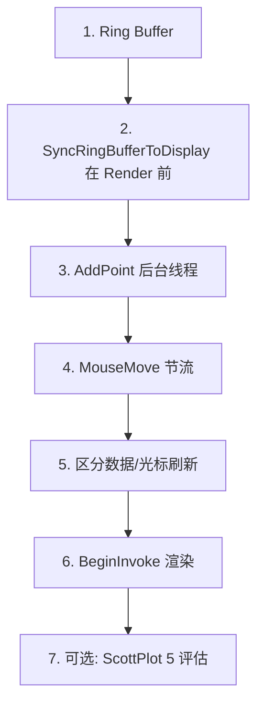

# 曲线 Tab 性能优化计划

## 一、优化项总览

| 序号  | 优化项                         | 预期收益                      | 实现难度 | 依赖                  |
| --- | --------------------------- | ------------------------- | ---- | ------------------- |
| 1   | Ring Buffer 替代数组左移          | AddPoint 从 O(n) 降为 O(1)   | 低    | 无                   |
| 2   | AddPoint 迁至后台线程             | 卸载 UI 线程，避免与渲染竞争          | 中    | 1（需保证 ringBuf 线程安全） |
| 3   | MouseMove 节流                | 降低十字光标更新的 UI 压力           | 低    | 无                   |
| 4   | 区分数据刷新与光标刷新                 | 有数据时高优先级，纯 MouseMove 低优先级 | 中    | 2、3                 |
| 5   | Dispatcher.BeginInvoke 异步渲染 | 避免渲染线程阻塞调用方               | 低    | 无                   |
| 6   | 评估 ScottPlot 5 升级           | 引入 DataStreamer 等实时流能力    | 高    | 需独立评估               |

---

## 二、分步实施

### 阶段一：数据结构与 AddPoint（优先级高）

**2.1 Ring Buffer 改造**

- **目标**：每次 AddPoint 从 O(1000) 左移改为 O(1) 写入
- **实现**：
  - 新增 `ringBuffer[10][1000]`、`head[10]`
  - 保留 `displayData[10][1000]` 供 ScottPlot 使用
  - AddPoint：`head[line] = (head[line] + 1) % MaxPoints; ringBuffer[line][head[line]] = d;`
  - 在 Render 前：`SyncRingBufferToDisplay()` 将 ringBuf 按时间顺序复制到 displayData
- **文件**：[PlotPage.xaml.cs](llcom/Pages/PlotPage.xaml.cs)
- **注意**：Clear 时需重置 `head` 并清零 ringBuffer

**2.2 AddPoint 迁移到后台线程**

- **目标**：AddPoint 不再占用 UI 线程
- **实现**：
  - `LinePlotAdd` 事件处理中，用 `Task.Run` 或 `ThreadPool.QueueUserWorkItem` 执行 AddPoint 逻辑
  - AddPoint 内：更新 ringBuffer（加锁或使用 `Interlocked` 保护 head），再 `Dispatcher.BeginInvoke` 触发 Refresh
  - 或：保持 AddPoint 在事件线程，但确保事件可来自非 UI 线程；若当前来自 UI 线程，需先调整 DataShow 的调用链
- **前置**：DataShow 构造函数在 `Dispatcher.Invoke` 中执行，apiAddPoint 在 UI 线程触发。要迁出需在 LuaApis.AddPoint 处用 `Task.Run` 包装，或让 LinePlotAdd 的订阅方在后台执行
- **建议**：在 PlotPage 的 `LinePlotAdd` 订阅中，用 `Task.Run(() => AddPoint(e.N, e.Line))`，AddPoint 内用 lock 保护 ringBuffer 更新，再 `Dispatcher.BeginInvoke(Refresh)`

---

### 阶段二：渲染与 MouseMove（优先级高）

**2.3 MouseMove 节流**

- **目标**：十字光标更新不随每次 MouseMove 触发，降低事件处理量
- **实现**：
  - 方案 A：`DispatcherTimer` 50～100ms 周期，在 Tick 中读取“最新待更新坐标”并更新 ch、Refresh
  - 方案 B：MouseMove 仅写 `pendingCrosshairX/Y`，用 `Dispatcher.BeginInvoke(DispatcherPriority.Background, ...)` 延迟执行，合并多次移动
  - 方案 C：MouseMove 时若距上次刷新不足 50ms 则跳过 Refresh，仅更新 ch 坐标（ch 更新成本低，可保留）
- **推荐**：方案 A，结构清晰，便于控制刷新频率

**2.4 区分“数据驱动”与“光标驱动”刷新**

- **目标**：有新数据时尽快刷新，仅 MouseMove 时降低刷新频率
- **实现**：
  - 新增 `NeedDataRefresh`（有 AddPoint 时置 true）、`NeedCrosshairRefresh`（MouseMove 时置 true）
  - 渲染线程：若 `NeedDataRefresh` 则优先执行 Sync + Render；若仅 `NeedCrosshairRefresh` 则限制为每 100～150ms 最多一次 Render
  - 或：MouseMove 时延后刷新（如 80ms 内无新数据再 Refresh），AddPoint 时立即 NeedRefresh

**2.5 渲染改为 BeginInvoke**

- **目标**：渲染线程不阻塞等待 UI 完成
- **实现**：将 `Dispatcher.Invoke` 改为 `Dispatcher.BeginInvoke`。注意需在回调中显式再次检查 `NeedRefresh`，避免渲染完成前新数据覆盖导致丢失刷新

---

### 阶段三：ScottPlot 5 评估（可选，优先级中）

**2.6 升级评估**

- **内容**：调研 ScottPlot 5 的 API 变更、DataStreamer/DataLogger 用法、与 WPF 的兼容性
- **收益**：DataStreamer 等专为实时流设计，可减少手写 ringBuf + 复制的逻辑
- **风险**：API 不兼容、需较大改动、可能影响其他图表功能
- **建议**：先完成阶段一、二，再单独评估；若 4.x 改造后已满足需求，可暂不升级

---

## 三、实现顺序建议

1. **Ring Buffer**：先改数据结构，验证显示正确
2. **SyncRingBufferToDisplay**：在现有渲染逻辑中插入，确保 Render 前数据已同步
3. **AddPoint 后台化**：在 ringBuf 线程安全前提下迁出 UI 线程
4. **MouseMove 节流**：用 Timer 或 BeginInvoke 合并十字光标更新
5. **数据/光标刷新分离**：细化 NeedRefresh 逻辑
6. **BeginInvoke**：替换 Invoke，减轻渲染线程阻塞
7. **ScottPlot 5**：独立评估与测试

---

## 四、关键代码变更点

| 位置                | 变更                                                            |
| ----------------- | ------------------------------------------------------------- |
| 字段                | `ringBuffer`、`head`、`displayData` 替代原 `Data`                  |
| AddPoint          | O(1) 写 ringBuffer，可选 lock                                     |
| Page_Loaded       | AddSignalXY 使用 displayData；Render 前调用 SyncRingBufferToDisplay |
| 渲染线程              | SyncRingBufferToDisplay → Plot.Render；Invoke 改为 BeginInvoke   |
| Plot_MouseMove    | 仅更新 pending 坐标；由 Timer 或节流逻辑触发 Refresh                        |
| ClearButton_Click | 清零 ringBuffer，重置 head                                         |

---

## 五、风险与回退

- **线程安全**：AddPoint 若在后台线程，需对 ringBuffer/head 加锁或使用原子操作
- **LinePlotAdd 调用线程**：需确认当前触发线程；若始终在 UI 线程，`Task.Run` 可保证后台执行
- **回退**：每阶段可独立提交，便于按需回退

